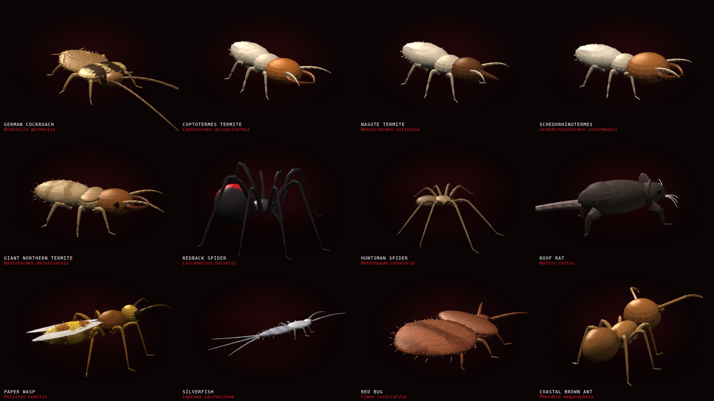
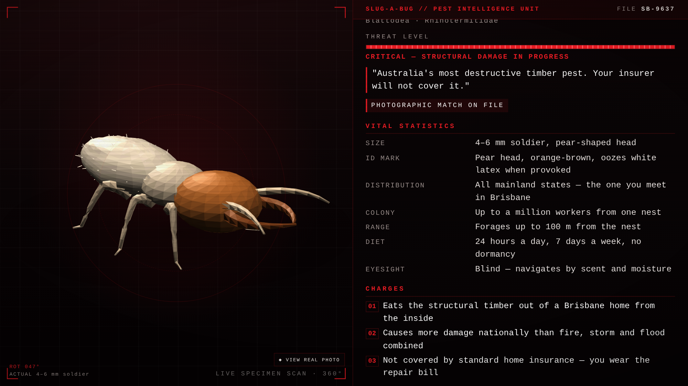
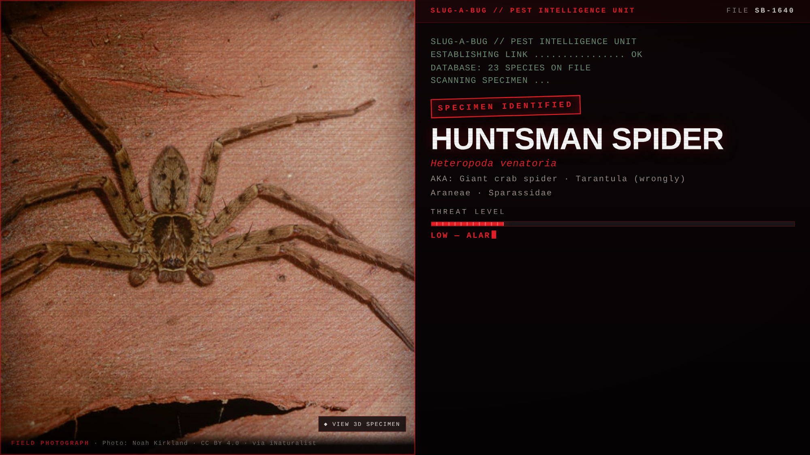

# Bugboss — Pest Dossier Engine

The assassin-movie target dossier, for pests.

A specimen rotates in 3D on the left. Down the right, a terminal types out the
file on it — species, common name, threat level, what it's guilty of, how it
operates, what evidence it leaves, where it hides, and how it gets treated —
with the clatter of the keys under it.

Built for **Slug-A-Bug Pest Control** (Brisbane & Gold Coast). Seventeen
species, each with a 3D specimen you can spin and a real field photograph to
match it against. One codebase serves three jobs:

| Job | What you use |
|---|---|
| **Website** | `dist/index.html` (gallery) and `dist/pest-dossier.html` (embed in an iframe) |
| **Social posts / UGC ads** | `node tools/record.mjs` → an MP4 with sound, sized for Reels, TikTok, Shorts or Meta Ads |
| **In person / on the tools** | Open the same page on a phone or tablet and hand it to the customer |

No 3D files, no stock footage, no CDN. Every specimen is generated from
numbers, every sound is synthesised in the browser, and the whole thing ships
as a single self-contained HTML file that works offline — about 1.7 MB with
the photographs baked in, or 120 KB if you build without them.







---

## The twenty-three specimens

Cockroaches: German · American · Australian
**Termites (the full Australian subterranean set):** Coptotermes acinaciformis ·
Coptotermes frenchi · Schedorhinotermes intermedius · Nasutitermes exitiosus ·
Nasutitermes walkeri · Mastotermes darwiniensis · Heterotermes ferox
Ants: coastal brown (big-headed) · black house
Spiders: redback · huntsman · white-tailed
Rodents: roof rat · house mouse
Biting: bed bug · cat flea
Wasps: paper · European
Stored goods: silverfish · pantry moth

The termites are modelled on the **soldier caste**, because that is the one
you identify from: Coptotermes' pear head and curved mandibles, Schedorhinotermes'
heavy-jawed major, Heterotermes' long rectangular head, Mastotermes' sheer
size, and the Nasutitermes snout — which has no mandibles at all and squirts
a defensive terpene out of the point instead.

Each one carries its own dossier copy, written for South-East Queensland
conditions, and its own body-plan numbers.

## Real photographs, not just models

The 3D specimen is what turns; a **real field photograph** is what convinces.
Mid-run the dossier cuts to one — captioned `FIELD PHOTOGRAPH`, with the
photographer's credit — then returns to the turntable. A toggle on the stage
switches between them at any time, and every gallery card carries the photo as
an inset beside the model.

The images come from openly licensed community observations (iNaturalist, ALA)
listed in `src/photo-sources.json`:

```bash
node tools/fetch-photos.mjs        # download, crop, compress, index
node tools/fetch-photos.mjs --recrop   # re-cut crops without re-downloading
```

**The licence has one condition and the pipeline enforces it.** These are
CC BY images: the photographer's name has to stay visible wherever the picture
appears. So a photo with no recorded photographer is never built in — the
fetcher refuses it rather than guessing. Credits appear under the photo in the
dossier, at the foot of the gallery, and in `dist/photos/CREDITS.txt`. Keep
them attached if you reuse the images anywhere else.

Two photos in the source list are downloaded but deliberately switched off:
the silverfish shot does not read as a silverfish at usable resolution, and
the only credited flea photo is an extreme micrograph of its head. An ID guide
that shows a misleading picture is worse than one that shows none. Both are
one flag away in `src/photo-sources.json` if you find better sources.

**Better still: use your own.** A photo you took on a job beats any of these
for trust. Drop it in `assets/photos/`, add an entry with
`"credit": "Slug-A-Bug"`, and re-run the fetcher.

## Quick start

```bash
npm install                    # needed for photo processing and video
node tools/fetch-photos.mjs    # pull the field photographs
node build.js                  # writes dist/
```

`node build.js` works without the photo step — you just get the 3D specimens
and a warning.

Then open `dist/index.html` in a browser. During development, open
`index.html` or `dossier.html` from the repo root — they load `src/` directly,
so there is no build step in the loop.

## Putting it on the website

1. Upload `dist/pest-dossier.html` (and `dist/index.html` if you want the
   gallery page) anywhere on the site — the root, or the WordPress Media
   Library.
2. Drop a **Custom HTML** block where you want it:

```html
<iframe src="/pest-dossier.html?pest=german-cockroach"
        style="width:100%;aspect-ratio:16/9;border:0"
        loading="lazy" title="German cockroach dossier"></iframe>
```

`dist/embed-snippets.html` has the copy-paste snippet for every pest plus the
vertical and random-specimen variants.

### URL parameters

| Parameter | Values | Notes |
|---|---|---|
| `pest` | any id, or `random` | see `dist/pest-ids.json` |
| `format` | `web` · `reel` · `square` · `wide` | 16:9, 9:16, 1:1, 16:9 |
| `speed` | e.g. `1.4` | typing speed multiplier |
| `items` | e.g. `3` | lines per section — fewer for reels |
| `chrome` | `0` | hide the picker and buttons |
| `cta` | `0` | hide the booking panel |
| `loop` | `1` | restart when it finishes |
| `hold` | `1` | build, but wait for `BBStage.play()` (used by the recorder) |

Sound is off until the visitor's first tap. That is a browser rule, not a
setting — no page anywhere can start audio before someone interacts with it.

## Making videos

```bash
npx playwright install chromium          # once
node tools/record.mjs --pest=redback-spider --format=reel
node tools/record.mjs --all --format=reel        # every specimen
```

Writes `dist/video/<pest>-<format>.mp4` — H.264 + AAC, 30 fps, with the
terminal audio captured straight off the Web Audio graph. 1080×1920 for
`reel`, 1080×1080 for `square`, 1920×1080 for `wide`.

Options: `--speed=1.3` `--items=3` `--hold=3` (seconds on the end card)
`--silent` `--out=some/dir`.

A reel runs about 30 seconds. Post it as-is, or drop it into your editor and
cut a talking-head intro in front of it.

## Adding a pest

Everything about a species lives in one object in `src/pests.js`: the dossier
copy and the body-plan numbers that generate the 3D model. Copy the closest
existing entry, change the numbers, run `node build.js`. Nothing else in the
system needs to know.

To check the shape, `node tools/shoot.mjs <pest-id>` renders a nine-angle
contact sheet to `.shots/` — much faster than watching the animation.

To change phone numbers, licences, the booking link or the call-to-action
wording, edit `src/brand.js`. It is the only place those strings exist.

## How it works

| File | Job |
|---|---|
| `src/core3d.js` | The 3D engine: matrices, mesh primitives, and a painter's-algorithm renderer on canvas 2D. Smooth vertex normals, per-face colour, alpha and unlit flags, weak perspective, ground shadow, tergite segmentation, per-face colour mottling, and scattered setae. ~600 lines, no dependencies. |
| `src/glb.js` | Loads a real `.glb` model onto the same stage: glTF parsing, node transforms, per-triangle texture sampling, decimation, re-orientation. |
| `src/anatomy.js` | Three body plans — insect, arachnid, rodent — assembled from ellipsoids and swept tubes. Species markings (pronotum stripes, wasp bands, the redback's blaze) are colour functions evaluated per face. Soldier features — mandibles, the nasute rostrum — are options. |
| `src/pests.js` | The database: dossier copy plus body-plan numbers. |
| `src/photo-sources.json` | Where the field photographs come from, with credits and crops. Hand-edited. |
| `src/photos.js` | Generated index of the prepared photos. Do not hand-edit. |
| `src/sfx.js` | Every sound, synthesised: key clicks, scan sweep, stamp, alarm, and the low drone under it all. |
| `src/dossier.js` | The sequence — boot, scan, lock, identity, threat meter, sections, call to action — plus formats, drag-to-rotate and skip. |
| `src/gallery.js` | The index page of specimens. |
| `build.js` | Inlines everything into self-contained HTML. Concatenation is the whole build. |
| `tools/` | Dev and export tools: `fetch-photos.mjs` (image pipeline), `shoot.mjs` (contact sheets), `preview.mjs` (screenshots + frame times), `record.mjs` (MP4), `check-glb.mjs` (real-model smoke test). |

Why canvas 2D and not three.js: the output has to survive being pasted into
WordPress, opened offline, and rendered by a headless recorder. A dependency-
free file does all three; 600 KB of WebGL library for eight bugs does not.

## Using real 3D models

Everything above is generated from numbers. If you want an actual scanned or
purchased model for a species, `src/glb.js` loads one and the dossier uses it:

```js
// in src/pests.js, on any species
model: { file: 'german-cockroach.glb', faces: 6500 }
```

Put the `.glb` in `assets/models/`. The generated specimen is shown first and
the real model swaps in when it loads, so a missing file degrades to a working
stage rather than an empty one, and the HUD label changes to `SCANNED SPECIMEN`.
The loader handles what a turntable actually needs: node transforms, base
colour textures sampled per triangle, re-centring and re-scaling to the shared
frame, and **vertex-clustering decimation** down to a face budget, because a
50k-triangle scan will not sort per frame on a phone.

Verify the path with `node tools/check-glb.mjs` — it fetches a sample model,
loads it in a real browser and reports triangles, load time and frame cost.

`assets/models/README.md` covers where to get models: photogrammetry of your
own specimens (free, best results, and no licence questions), AI image-to-3D
services (fast, but thin legs and antennae are their known failure mode), or
buying one. Models are copied to `dist/models/` rather than inlined — a scan is
megabytes, and base64 would wreck the single-file build for everyone who never
uses one.

## Why the shipped specimens are generated rather than scanned

The obvious question is why not use real scanned 3D models. Short version: the
tradeoff does not pay off here.

- **Weight.** A photogrammetry or CT-scanned insect runs 5–50 MB each. Twenty-
  three of those is a slow website and no single-file build.
- **Licensing.** The good ones are paid, and the free ones are a mix of CC BY,
  non-commercial and unclear. Non-commercial is useless for advertising.
- **Quality.** CT scans are grey and dead-looking; photogrammetry of something
  12 mm long is usually mush. Neither turns nicely on a black stage.
- **Reach.** They cannot be fetched from this build environment anyway — every
  3D asset host is blocked by network policy.

What the generated approach buys instead: 3–6 k triangles per specimen, 7 ms a
frame at 1080×1920, a new species in about thirty lines of data, and correct
anatomy for the caste that actually matters. The realism comes from segmented
tergites, per-face colour mottling, fine setae and smooth normals rather than
from scan data — and the real field photograph sits one tap away for anything
the model cannot claim.

If you do want a scanned model for a hero pest, buy one good one (roughly
$20–80 on TurboSquid or CGTrader), and it can be wired in behind a WebGL
renderer for that species alone.

## Honest limits

- The specimens are **stylised, not scientific illustration**. They are built
  to be recognisable at a glance and to look good turning — a technician can
  tell a German from an American cockroach in these, but do not use them as
  an identification key. The photographs are there for exactly that reason.
- The **Australian cockroach has no photograph**: both images for it live on
  the Atlas of Living Australia, which was unreachable from the build machine.
  Its entry is otherwise complete, and re-running the fetcher anywhere with
  normal internet access will pick it up.
- The dossier copy is marketing copy grounded in the biology. Check anything
  you plan to put a number on in an ad.
- Older phones will render the turntable closer to 30 fps than 60. It stays
  smooth; it is not free.
